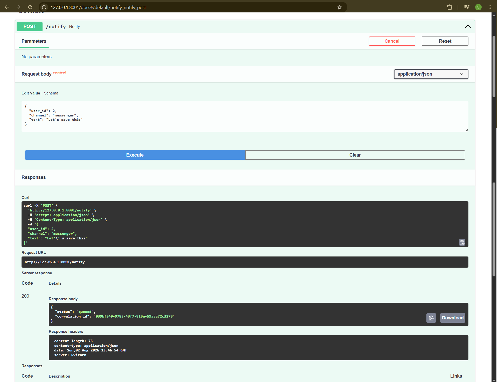
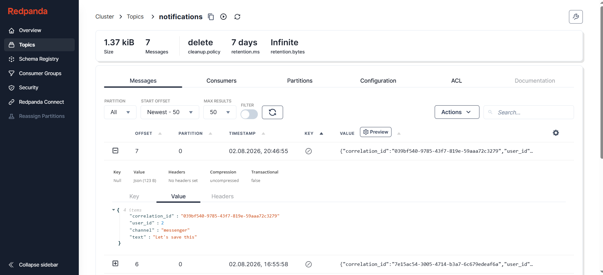
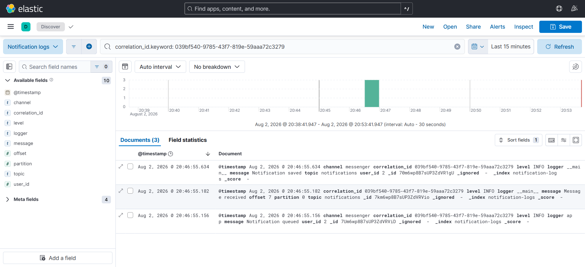

# Notification Platform — Kafka + Observability


A small event-driven notification system built to close a specific gap: hands-on experience with **Kafka-style event streaming** and **log-based observability** (structured logging, centralized search, distributed tracing via correlation ID) — skills that come up often in QA Automation job postings but weren't covered by my other projects ([Habitual](https://github.com/Zhelero/habitual_api)).

Not a production notification service — a focused, working slice of the pattern: an API that publishes an event, a worker that consumes it and persists it, and full visibility into that event's journey through the system.

## What it demonstrates

- Producing and consuming messages with Kafka (via Redpanda, a Kafka-API-compatible broker)
- Structured JSON logging, with every log line automatically shipped to Elasticsearch
- Docker Compose with health checks gating service startup order (no more "consumer crashes because Kafka wasn't ready yet")
- End-to-end event tracing across FastAPI → Kafka → PostgreSQL → Elasticsearch using a shared correlation_id
- Idempotent message processing: a client can retry with the same `correlation_id`, and duplicate delivery is detected and skipped instead of creating a second record
- Consumer resilience: a malformed or non-JSON message on the topic is logged and skipped, without crashing the consume loop for every message after it
- GitHub Actions CI that provisions infrastructure and runs both unit and integration tests against a real Kafka + PostgreSQL pipeline

## Tracing one event through the system

Every request gets a `correlation_id`. That same ID shows up in the API response, in the Kafka message payload, and in every log line the event produces — which means you can take one ID and find its entire journey across three different systems.







*One `correlation_id` — from the API response, through the Kafka message, to every log line it produced.*

## How to trace a message

Send a notification:

**`POST /notify`**

The API returns a correlation_id:
```json
{
  "status": "published",
  "correlation_id": "8f2c1d..."
}
```

That same ID appears in:

- the Kafka message payload,
- the consumer logs,
- the Elasticsearch index,
- the PostgreSQL record.

Example Elasticsearch query:

```http
GET /notification-logs/_search
{
  "query": {
    "term": {
      "correlation_id.keyword": "8f2c1d..."
    }
  }
}
```

This returns every log line generated by that event, making it possible to reconstruct its full processing path.

## Architecture

```
┌────────────┐   POST /notify    ┌──────────────┐
│   Client   │ ────────────────► │   Producer   │
└────────────┘                   │  (FastAPI)   │
                                 └──────┬───────┘
                                        │ publish
                                        ▼
                                  ┌────────────────┐
                                  │Redpanda(Kafka) │
                                  │ "notifications"│
                                  └──────┬─────────┘
                                         │ consume
                                         ▼
                                  ┌──────────────┐
                                  │   Consumer   │
                                  │   (worker)   │
                                  └──────┬───────┘
                                         │
                          ┌──────────────┴───────────────┐
                          ▼                              ▼
                   ┌───────────────┐            ┌────────────────────┐
                   │ PostgreSQL    │            │   Elasticsearch    │
                   │(notifications)│            │(notification-logs) │
                   └───────────────┘            └─────────┬──────────┘
                                                          ▼
                                                    ┌───────────┐
                                                    │  Kibana   │
                                                    └───────────┘
```

Both the producer and the consumer log every step (request received, message published, message consumed, notification saved) as structured JSON, which is shipped to Elasticsearch automatically via a custom logging handler — no separate log shipper needed for this scale. Messages remain in Kafka even if the consumer is offline. When the worker starts again, it resumes processing from the last committed offset, which makes the system resilient to temporary consumer downtime.

**Idempotency.** A client can supply its own `correlation_id` in the request (e.g. when retrying a failed call). `correlation_id` is enforced unique at the database level via an Alembic migration, so a retried message is detected as a duplicate and skipped — no second row, no crash, just a `"Duplicate notification ignored"` log line instead of the usual `"Notification saved"`.

**Malformed messages.** JSON decoding happens explicitly inside the consumer's per-message `try/except` (`consumer/decoding.py`), not as an `AIOKafkaConsumer` value_deserializer — a deserializer that raises would break the `async for msg in consumer` loop itself, outside any error handling. A message that isn't valid JSON, or is missing a required field, is logged and skipped instead of taking the whole consumer down.

## Tech stack

- **API**: FastAPI, Pydantic
- **Streaming**: Kafka protocol via Redpanda, `aiokafka`
- **Storage**: PostgreSQL, `asyncpg`, schema migrations via `alembic`
- **Observability**: structured JSON logs (`python-json-logger`) shipped to Elasticsearch, visualized in Kibana
- **Infra**: Docker Compose, with health checks gating startup order across all 5 services

## Getting started

```bash
git clone <repo-url>
cd notification-platform
docker compose up -d
```

This starts Redpanda, Redpanda Console, PostgreSQL, Elasticsearch, and Kibana, in the right order (Console waits for Redpanda to be healthy, Kibana waits for Elasticsearch).

Install dependencies (one shared file for both services):

```bash
pip install -r requirements.txt
```

Apply database migrations (adds the `correlation_id` unique constraint that makes duplicate-message handling idempotent):

```bash
alembic upgrade head
```

Run the producer:

```bash
uvicorn producer.app:app --reload --port 8001
```

Run the consumer:

```bash
python -m consumer.worker
```

Shipping logs to Elasticsearch/Kibana is off by default — to reproduce the tracing walkthrough shown above (the Kibana screenshot), set `ENABLE_ELASTIC_LOGGING=true` before starting the producer and the consumer:

```bash
# producer
ENABLE_ELASTIC_LOGGING=true uvicorn producer.app:app --reload --port 8001

# consumer
ENABLE_ELASTIC_LOGGING=true python -m consumer.worker
```

Without the flag, both services still log structured JSON to the console — they just don't ship it to Elasticsearch, so `docker compose up` doesn't pay the cost of an Elasticsearch connection unless you actually want to use Kibana.

Send a notification:

```bash
curl -X POST http://127.0.0.1:8001/notify \
  -H "Content-Type: application/json" \
  -d '{"user_id": 2, "channel": "messenger", "text": "Let'\''s save this"}'
```

## Where to look

| What | Where |
|---|---|
| API docs (Swagger) | http://127.0.0.1:8001/docs |
| Redpanda Console (topics, messages) | http://localhost:8080 |
| Kibana (log search) | http://localhost:5601 |
| Elasticsearch | http://localhost:9200 |
| PostgreSQL | `localhost:5433` (`app` / `app`, db `notifications`) |

## API

**`POST /notify`**

```json
{
  "user_id": 2,
  "channel": "messenger",
  "text": "Let's save this"
}
```

Response:

```json
{
  "status": "published",
  "correlation_id": "039bf540-9785-43f7-819e-59aaa72c3279"
}
```

## Testing

Two layers of tests, mirroring the split between fast feedback and real confidence:

**Unit tests** — mock Kafka/DB, no infrastructure needed:
```bash
pytest producer/tests/test_notify.py consumer/tests/test_save_notification.py consumer/tests/test_decoding.py
```
Cover request validation, the producer's 503 response when Kafka is unreachable, and the consumer's duplicate/decoding logic in isolation.

**Integration tests** — exercise the real pipeline end-to-end. Require the full stack running:
```bash
docker compose up -d
pip install -r requirements.txt
alembic upgrade head
# in one terminal: uvicorn producer.app:app --port 8001
# in another:      python -m consumer.worker
# then, from the repo root:
pytest producer/tests/integration consumer/tests/integration
```
- `producer/tests/integration/test_notification_flow.py` — happy path, message volume, data integrity across concurrent users, correlation_id uniqueness, idempotent duplicates, and request validation, grouped into `TestEndToEndFlow`, `TestDataIntegrity`, `TestMessageIdentity`, and `TestValidation`.
- `consumer/tests/integration/test_consumer_resilience.py` — the consumer's behavior on bad input specifically: a message missing `correlation_id`, a payload missing required fields, a non-JSON message, and a duplicate delivery — asserting in each case that the consumer keeps processing everything that comes after.

Run everything at once with:
```bash
pytest
```
(`pytest.ini` already points at both `producer/tests` and `consumer/tests`.)

**Continuous integration**

Every push and pull request automatically runs the full test pipeline in GitHub Actions:

- installs dependencies,
- starts Redpanda and PostgreSQL,
- initializes the database,
- runs producer and consumer unit tests,
- starts the producer and consumer,
- executes the full integration test suite,
- fails the build if any stage of the pipeline is broken.

## Project structure

```
notification-platform/
├── .github/
│   └── workflows/
│       └── ci.yml                # GitHub Actions pipeline
├── producer/                     # FastAPI service that publishes notifications to Kafka
│   ├── app.py
│   ├── config.py
│   ├── schemas.py
│   ├── logging_config.py
│   ├── elastic_handler.py
│   └── tests/
│       ├── test_notify.py        # unit tests (mocked Kafka)
│       └── integration/          # real pipeline, needs the full stack running
├── consumer/                     # Kafka consumer that persists notifications and logs their lifecycle
│   ├── worker.py
│   ├── config.py
│   ├── db.py
│   ├── decoding.py               # message decoding and validation boundary
│   ├── logging_config.py
│   ├── elastic_handler.py
│   └── tests/
│       ├── test_save_notification.py
│       ├── test_decoding.py
│       └── integration/          # real pipeline, needs the full stack running
├── migrations/                   # Alembic migrations (e.g. correlation_id unique constraint)
│   └── versions/
├── db/
│   └── init.sql                  # notifications table schema
├── docs/screenshots/              # tracing walkthrough screenshots used in this README
├── alembic.ini
└── docker-compose.yml             # Redpanda, Console, Postgres, Elasticsearch, Kibana
```

## Status

The project currently includes:

- asynchronous event delivery via Kafka (Redpanda),
- idempotent consumer processing,
- structured JSON logging,
- Elasticsearch + Kibana observability,
- unit and integration test suites,
- GitHub Actions CI,
- protected `main` branch with required CI checks.


## What I learned

This project was mainly about understanding how event-driven systems behave in practice, not just in theory. The most important takeaways were:

- designing an event-driven pipeline,
- making consumers idempotent,
- tracing events across multiple systems with correlation IDs,
- building reproducible integration tests and CI.

## Author

Stanislav Zheleznov — [GitHub](https://github.com/Zhelero) · [LinkedIn](https://linkedin.com/in/stanislav-zheleznov)